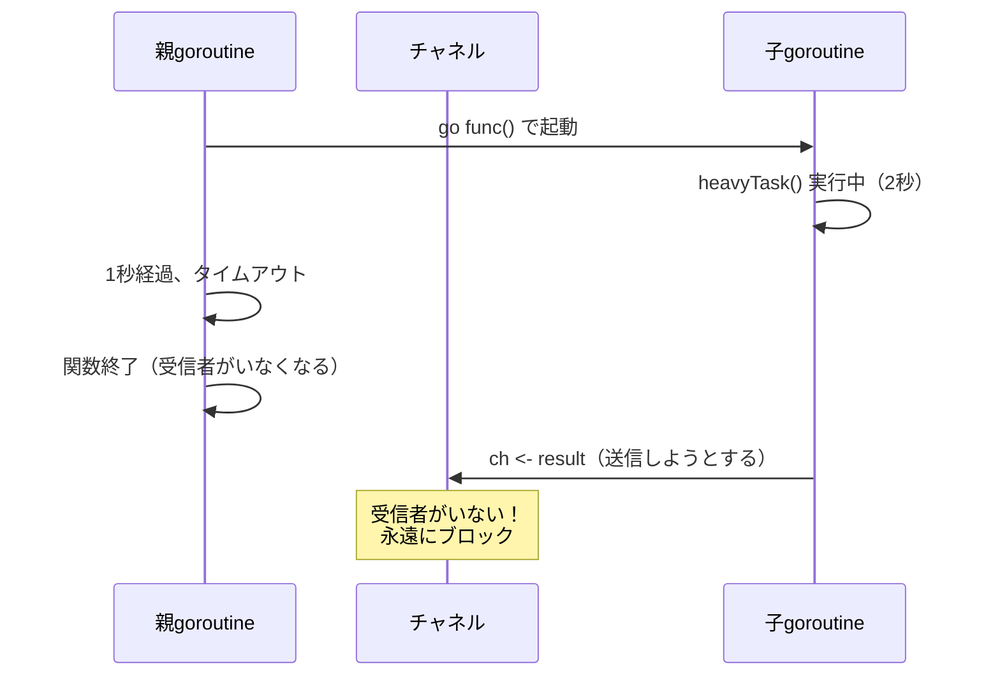
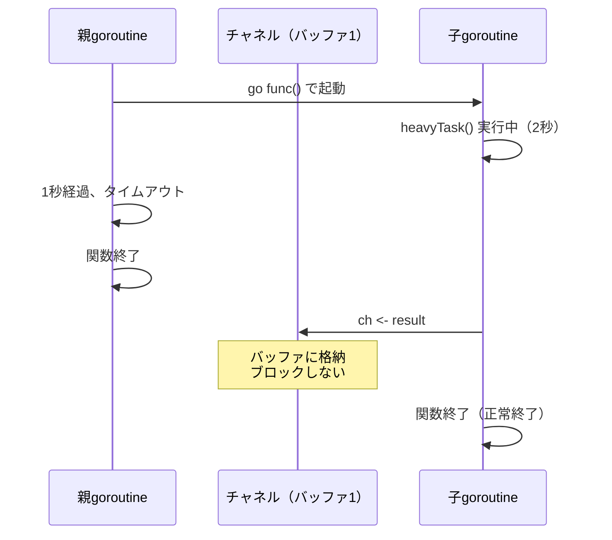

## 背景

業務中にサーバーのメモリ使用率が異常に上昇し、プロセスがメモリを食いつくしかける問題に遭遇した。

当時、goroutineについて深く理解しないまま「`go`をつければ非同期で動いてくれるんでしょ」くらいの認識でFire-and-Forget的に処理を投げていた。処理自体は複雑でも重いものでもなかったが、goroutineの終了条件を考慮せずに書いていたため、気づかないうちにgoroutineが溜まり続け、サービスが落ちかける事態になった。

:::message
**Fire-and-Forgetとは**: 処理を起動したら、その結果を待たずに呼び出し元が先に進むパターン。「撃ったら忘れる」の意味で、非同期処理でよく使われる手法だが、起動した処理の終了管理がおろそかになりやすい。
:::

この経験から「goroutineリーク」という概念を体系的に理解したくなり、実際にリークを起こすコードを書いて動かしてみることにした。本記事では、最もシンプルな「ブロッキング型」のgoroutineリークを解説する。

## goroutineリークとは

goroutineが終了せずにメモリ上に残り続ける現象のこと。

Goのガベージコレクタ（GC）は「待機中のgoroutine」を回収しないため、リークしたgoroutineはプログラムが終了するまで残り続ける。

サーバーアプリケーションでは、リクエストごとにgoroutineが溜まっていき、最終的にメモリ枯渇やCPU使用率の上昇を引き起こす。

## 問題のあるコード

以下は、Webサーバーのリクエストハンドラをシミュレートしたコード。

```go:step1_blocking_leak/main.go
package main

import (
	"fmt"
	"runtime"
	"time"
)

// 重い処理をシミュレート（2秒かかる）
func heavyTask() int {
	time.Sleep(2 * time.Second)
	return 100
}

// リクエストハンドラのシミュレーション
func handleRequest(requestID int) {
	// ⚠️ バッファなしチャネル（これが落とし穴）
	ch := make(chan int)

	go func() {
		result := heavyTask()
		ch <- result // ⚠️ ここでブロック！受信者がいないと永遠に待つ
		fmt.Printf("[Request %d] 送信完了\n", requestID)
	}()

	// 1秒でタイムアウト
	select {
	case res := <-ch:
		fmt.Printf("[Request %d] 成功: %d\n", requestID, res)
	case <-time.After(1 * time.Second):
		fmt.Printf("[Request %d] タイムアウト！\n", requestID)
		// ここで関数を抜けるが、子goroutineは残り続ける
	}
}

func main() {
	fmt.Printf("初期goroutine数: %d\n\n", runtime.NumGoroutine())

	for i := 1; i <= 10; i++ {
		handleRequest(i)
		fmt.Printf("  → 現在のgoroutine数: %d\n\n", runtime.NumGoroutine())
	}

	fmt.Println("--- 5秒後 ---")
	time.Sleep(5 * time.Second)
	fmt.Printf("最終goroutine数: %d\n", runtime.NumGoroutine())
}
```

### 実行結果

```text:実行結果
初期goroutine数: 1

[Request 1] タイムアウト！
  → 現在のgoroutine数: 2

[Request 2] タイムアウト！
  → 現在のgoroutine数: 3

...

[Request 10] タイムアウト！
  → 現在のgoroutine数: 11

--- 5秒後 ---
最終goroutine数: 11
```

**本来なら1（mainのみ）になるはずが、11個のgoroutineが残っている。** これがgoroutineリーク。

## 何が起きているか

### バッファなしチャネルの動作

バッファなしチャネル（`make(chan int)`）は、送信と受信が**同時に**揃わないと処理が進まない。



### なぜGCに回収されないのか

Goのランタイムから見ると、チャネル待ちのgoroutineは「処理中」の状態にある。

「終了した」わけではないので、GCの対象にならない。

:::message
goroutineは「終了条件を満たせない状態」でも、ランタイム上は「生きている」と判断される。

参考: [A Guide to the Go Garbage Collector](https://go.dev/doc/gc-guide)
:::

## 解決策

### 方法1: バッファ付きチャネルを使う

最もシンプルな解決策は、チャネルにバッファを持たせること。

```go:修正版
ch := make(chan int, 1)  // バッファサイズ1
```

バッファがあれば、受信者がいなくても1つまでは送信できる。



### 方法2: Contextでキャンセルを伝える

より堅牢な方法として、`context.Context`を使ってキャンセルを伝播させる方法がある。

```go:Context版
func handleRequest(requestID int) {
	ctx, cancel := context.WithTimeout(context.Background(), 1*time.Second)
	defer cancel()

	ch := make(chan int, 1)

	go func() {
		result := heavyTask() // ← この処理は同期的に実行される（2秒ブロック）
		select {
		case ch <- result:    // チャネルに空きがあれば送信
		case <-ctx.Done():    // heavyTask完了後、ctx がキャンセル済みならここに入る
			return
		}
	}()

	select {
	case res := <-ch:
		fmt.Printf("[Request %d] 成功: %d\n", requestID, res)
	case <-ctx.Done():
		fmt.Printf("[Request %d] タイムアウト！\n", requestID)
	}
}
```

この方法では、親がタイムアウトした時点で`ctx.Done()`が通知され、子goroutineも即座に終了できる。

## リンターで早期発見する

こうしたgoroutineリークは、人間のコードレビューだけで防ぐのは難しい。

[golangci-lint](https://golangci-lint.run/)を導入し、CIで回すことで、問題のあるコードパターンを早期に検出できる可能性がある。

:::message
ただし、リンターを入れればgoroutineリークを完全に防げる、という保証は無さそう。最も重要なのは、`go`キーワードを見たら「このgoroutineはいつ終了するのか？」を意識する習慣をつけることだ。
:::

## どういう時に気をつけるべきか

自分の経験を踏まえると、以下のような場面では特に注意が必要だ。

### 1. Fire-and-Forgetで処理を投げるとき

「結果を待たなくていいから`go`で投げておこう」という場面。DBへの書き込み、外部APIへの通知、ログ送信など。

```go
// 危険なパターン
go sendNotification(userID, message)  // 誰も終了を待っていない
```

このgoroutineが正常に終了する保証はどこにあるのか？エラー時はどうなるのか？を考える必要がある。

### 2. タイムアウト処理を書くとき

「3秒以内に終わらなければキャンセル」のような処理。親がタイムアウトで抜けた後、子goroutineがどうなるかを必ず考える。

### 3. チャネルを使った通信

特にバッファなしチャネル。送信側と受信側のライフサイクルが一致しているかを確認する。

## この知識が役立つ場面

- **本番障害の原因調査**: CPU/メモリが異常に高い → goroutineリークを疑える
- **コードレビュー**: `go`キーワードを見たら「終了条件は？」と考える習慣がつく
- **設計段階**: 非同期処理の設計時に、goroutineのライフサイクルを意識できる

## まとめ

goroutineリークは、特にサーバーアプリケーションで致命的な問題になりうる。

自分の場合、「処理が複雑だから問題が起きた」のではなく、**goroutineの基本的な挙動を知らずに雰囲気で書いていたから問題が起きた**。これが一番の教訓だ。

goroutineを`go`で起動するときは、**「このgoroutineはいつ、どうやって終わるのか？」** を常に意識することが重要だ。

| パターン             | 原因                               | 対策                        |
| -------------------- | ---------------------------------- | --------------------------- |
| バッファなしチャネル | 受信者がいなくなり送信がブロック   | バッファ付きにする          |
| キャンセル無視       | Context.Done()をチェックしていない | selectでDone()を監視        |
| リンター未導入       | 問題のあるコードがすり抜ける       | golangci-lintをCIに組み込む |

今回作成したコードは以下のリポジトリで公開している。

https://github.com/yasuaki640/goroutine-prac

以上。
