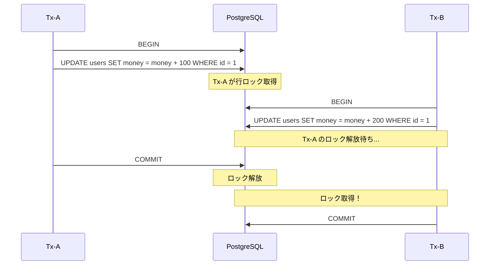

## 背景

本番環境のログを監視していたところ、`could not obtain lock on row`というエラーが断続的に発生していることに気づいた。このエラーが原因で一部のユーザーは処理に失敗し、再操作を求められる状況になっていた。

調査すると、既存コードには`FOR UPDATE NOWAIT`が設定されていた。当時の自分は「PostgreSQLはMVCCだから読み取りと書き込みは競合しない」という知識しかなく、なぜNOWAITが必要なのか、そしてなぜエラーが出ているのかがピンとこなかった。

コードの意図を調べたが、ドキュメントは残っていなかった。おそらく「ロックを長く保持し続けないようにしたい」という意図があったのだと思う。このエラーをきっかけにPostgreSQLのロック競合について調べ、NOWAITの役割を理解することができた。

結局、NOWAITはそのまま残しつつ、根本原因であるトランザクション範囲の見直しを別途進めることにした。この記事では、そのとき学んだロック競合の仕組みとNOWAITの使いどころを整理する。

## ロック競合とは

PostgreSQLはMVCC（Multi-Version Concurrency Control）により、読み取りと書き込みは基本的に競合しない。しかし、**同一行に対する書き込み同士（Writer vs Writer）は競合する**。

これは、データの整合性を保つために必要な動作だ。例えば、同じ口座から同時に引き落としが発生した場合、一方が完了するまで他方は待機する必要がある。



Tx-Bは、Tx-Aがコミット（またはロールバック）するまで**ブロックされる**。Tx-Aが長時間ロックを保持していると、Tx-Bはその間ずっと待ち続ける。

## 実際にロック競合を起こしてみる

以下は、Goで2つのトランザクションを並行実行し、ロック競合を観察するコード。

```go
// ===== Tx-A: 先にロックを取得し、3秒間保持 =====
go func() {
    tx, _ := db.Begin()
    logf("Tx-A", "BEGIN")

    logf("Tx-A", "UPDATE実行（ロック取得）")
    tx.Exec("UPDATE users SET money = money + 100 WHERE id = 1")

    logf("Tx-A", "ロックを3秒保持中...")
    time.Sleep(3 * time.Second)

    tx.Commit()
    logf("Tx-A", "COMMIT完了")
}()

// ===== Tx-B: 1秒後に開始（Tx-Aのロック解放を待つ） =====
go func() {
    time.Sleep(1 * time.Second) // Tx-Aがロック取得した後に開始

    tx, _ := db.Begin()
    logf("Tx-B", "BEGIN")

    logf("Tx-B", "UPDATE実行（ロック待ち...）")
    start := time.Now()
    tx.Exec("UPDATE users SET money = money + 200 WHERE id = 1") // ← ここでブロック！
    logf("Tx-B", "ロック取得！（%.2f秒待った）", time.Since(start).Seconds())

    tx.Commit()
    logf("Tx-B", "COMMIT完了")
}()
```

### 実行結果

```text
[12:00:00.000] [Tx-A] BEGIN
[12:00:00.001] [Tx-A] UPDATE実行（ロック取得）
[12:00:00.002] [Tx-A] ロックを3秒保持中...
[12:00:01.000] [Tx-B] BEGIN
[12:00:01.001] [Tx-B] UPDATE実行（ロック待ち...）
[12:00:03.002] [Tx-A] COMMIT完了
[12:00:03.003] [Tx-B] ロック取得！（2.00秒待った）
[12:00:03.004] [Tx-B] COMMIT完了
```

Tx-Bは約2秒間ブロックされた。本番環境でTx-Aが何分もロックを保持していたら、Tx-Bはその間ずっと待ち続けることになる。

## NOWAITで待たずに即エラーにする

`FOR UPDATE NOWAIT`を使うと、ロックが取得できない場合に**待機せず即座にエラー**を返す。

```sql
SELECT * FROM users WHERE id = 1 FOR UPDATE NOWAIT;
```

ロックが取得できなければ、以下のエラーが即座に返る。

```
ERROR: could not obtain lock on row in relation "users"
```

### NOWAITを使ったコード

```go
// ===== Tx-B: 1秒後に開始（NOWAITで即座にエラー） =====
go func() {
    time.Sleep(1 * time.Second)

    tx, _ := db.Begin()
    logf("Tx-B", "BEGIN")

    // ★ FOR UPDATE NOWAIT はロック取得できなければ即エラー
    logf("Tx-B", "SELECT FOR UPDATE NOWAIT 実行...")
    var money int
    err := tx.QueryRow("SELECT money FROM users WHERE id = 1 FOR UPDATE NOWAIT").Scan(&money)
    if err != nil {
        logf("Tx-B", "★ NOWAIT エラー: %v", err)
        tx.Rollback()
        return
    }

    // ロック取得成功した場合のみ、ここに到達
    logf("Tx-B", "ロック取得成功！ money=%d", money)
    tx.Exec("UPDATE users SET money = money + 200 WHERE id = 1")
    tx.Commit()
    logf("Tx-B", "COMMIT完了")
}()
```

### 実行結果

```text
[12:00:00.000] [Tx-A] BEGIN
[12:00:00.001] [Tx-A] UPDATE実行（ロック取得）
[12:00:00.002] [Tx-A] ロックを3秒保持中...
[12:00:01.000] [Tx-B] BEGIN
[12:00:01.001] [Tx-B] SELECT FOR UPDATE NOWAIT 実行...
[12:00:01.002] [Tx-B] ★ NOWAIT エラー: pq: could not obtain lock on row in relation "users"
[12:00:03.002] [Tx-A] COMMIT完了
[Main] Final money: 1100 （Tx-Bは失敗したので +100 のみ）
```

Tx-Bは待機せず、即座にエラーとなった。これにより、後続の処理でリトライしたり、ユーザーにエラーを返したりといった対応ができる。

:::message
**NOWAITは悲観的ロックの一種であり、楽観的ロックとは異なる**

楽観的ロック（Optimistic Locking）は、バージョン番号やタイムスタンプを使い、コミット時に競合を検出する方式。NOWAITは「ロック取得を試み、取れなければ即エラー」という動作であり、あくまで悲観的ロック（Pessimistic Locking）のバリエーションだ。
:::

## NOWAITのユースケース

| ユースケース | 説明 |
|-------------|------|
| 在庫確保・座席予約 | 競合時は「他の人が処理中です」と即座にエラーを返す |
| リアルタイムAPI | SLAが厳しく、待機時間を許容できない場合 |
| ジョブキュー | ロック済みの行はスキップし、別の行を処理 |
| デッドロック回避 | 待機せずエラーにすることで、デッドロックのリスクを軽減 |

## 根本解決も忘れずに

NOWAITは便利だが、あくまで**応急処置**だ。根本的にはロック競合を減らす設計が重要。

### トランザクションを短く保つ

```go
// ❌ 悪い例：トランザクション内で外部API呼び出し
tx.Begin()
tx.Exec("UPDATE ...")
callExternalAPI()  // ← これが遅いとロック保持時間が長くなる
tx.Commit()

// ✅ 良い例：外部APIはトランザクション外で
data := callExternalAPI()
tx.Begin()
tx.Exec("UPDATE ... SET data = ?", data)
tx.Commit()
```

### lock_timeoutを設定する

PostgreSQLの`lock_timeout`を設定すると、指定時間を超えてロック待ちしている場合にエラーになる。

```sql
SET lock_timeout = '5s';
```

これにより、NOWAITを使わなくても「永遠に待ち続ける」状況を防げる。

## まとめ

| 項目 | 内容 |
|------|------|
| ロック競合 | MVCCでもWriter vs Writerは競合する |
| NOWAIT | ロック取得できなければ即エラー |
| 主なユースケース | 在庫確保、リアルタイムAPI、ジョブキュー |
| 根本対策 | トランザクションを短く、lock_timeout設定 |

今回作成したコードは以下のリポジトリで公開している。

https://github.com/yasuaki640/pg-lock-demo

以上。
